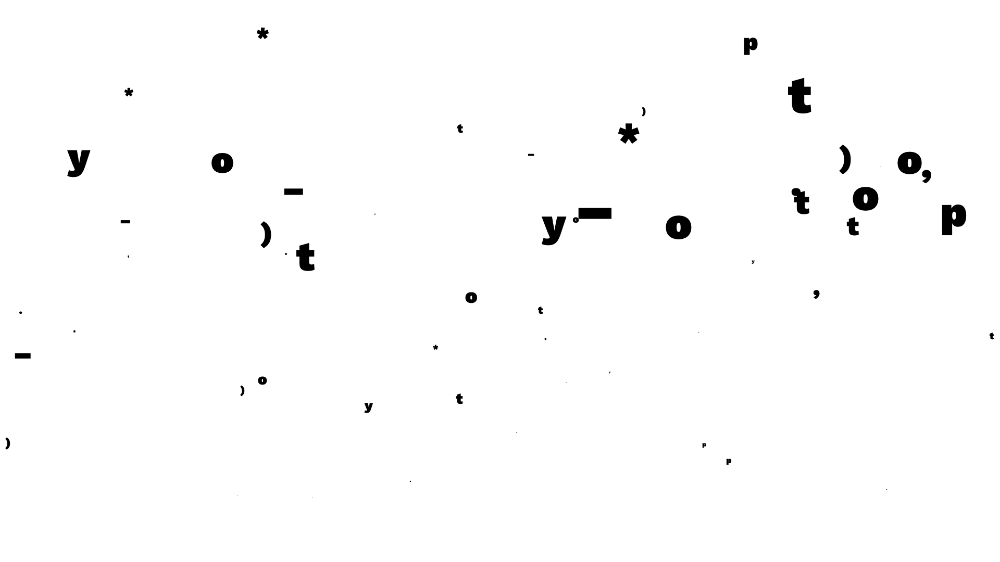
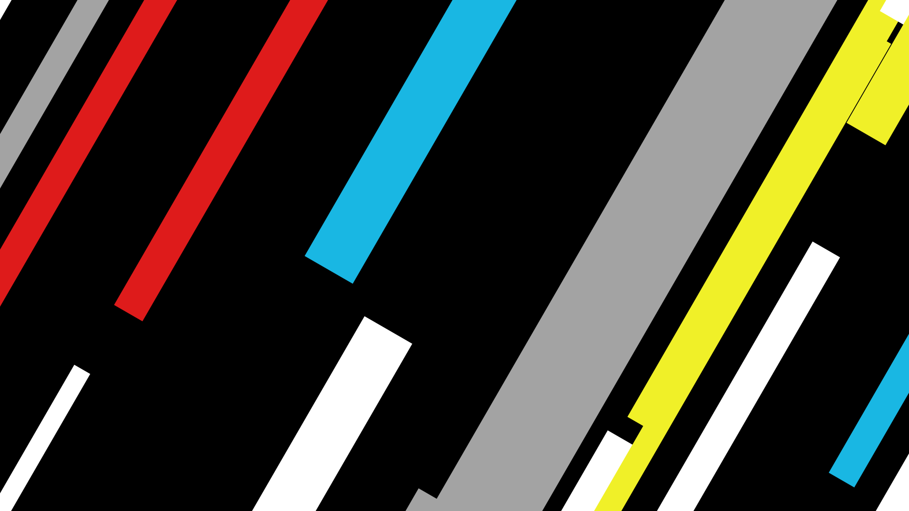

# Drawbot Experiments
Some experiments made during the workshop [Creative Coding & Variable Fonts](https://web.archive.org/web/20200207142557/https://www.zhdk.ch/weiterbildung/sws/creative-coding-variable-fonts-programmierte-und-animierte-typografie-7475) at [Zurich University of the Arts](https://www.zhdk.ch/en/).

## TypoBubbles
Animation of TypoBubbles. This Animation needs to have the Font [WorkSans-Regular Black](http://weiweihuanghuang.github.io/Work-Sans/) installed.

### Attributes
* Bubbles get linear bigger
* Bubbles get linear to the top
* End of life (pop) is in the upper part
* Bubbles «shake» in a sinus → smaller quicker, bigger slower

## Gradient
Animation of a «Random Gradient».

### Attributes
* Time and resolution independant code
* Config and Helpers in a separate File

### Mentors
* [Christine Gertsch](https://christinegertsch.net/)
* [Josef Renner](https://www.zhdk.ch/person/josef-renner-9277)

### Licence
MIT License –  2020 Stefan Huber
